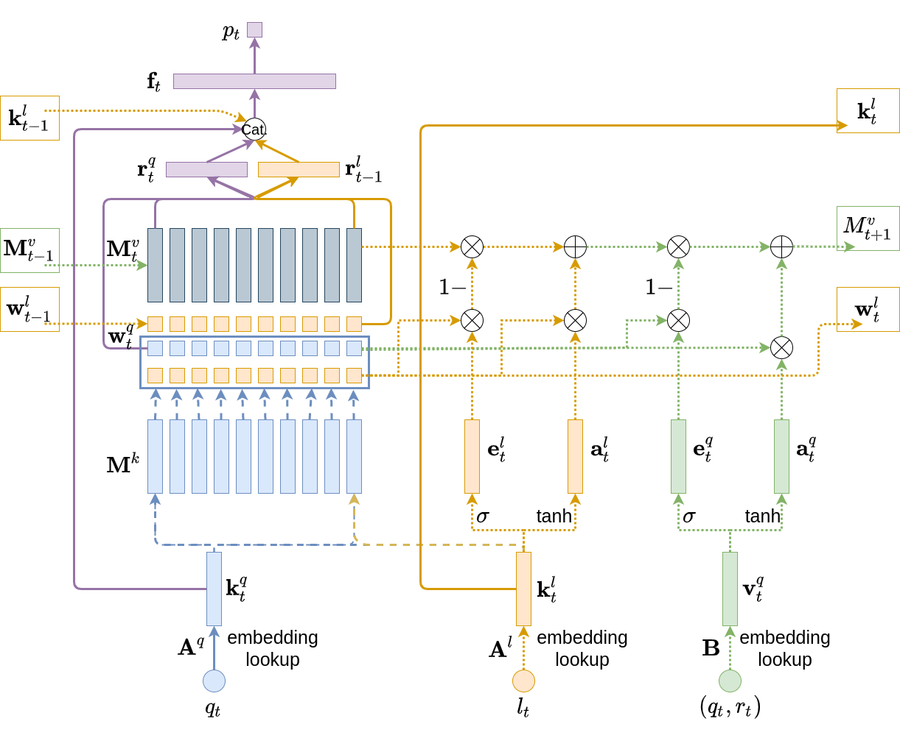

# Deep Multi-Type Knowledge Tracing (DMKT)
Code for our paper:

C. Wang, S. Zhao, and S. Sahebi. Learning from Non-Assessed Resources: Deep Multi-TypeKnowledge Tracing. In Proceedings of The 14th International Conference onEducational Data Mining, 2021.

If you have any questions, please email cwang25@albany.edu

## DMKT Network Architecture:




## How to install and run 

For example, to run the DMKT model on MORF dataset:
```angular2html
git clone https://github.com/persai-lab/EDM2021-DMKT
cd EDM2021-DMKT
conda env create -f environment.yml
source init_env.sh
cd deepkt
python run.py -c configs/dmkt_morf686_best_0.json
```


## Cite:

Please cite our paper if you use this code in your own work:

```
@inproceedings{wang2021dmkt,
  title={Learning from Non-Assessed Resources: Deep Multi-Type Knowledge Tracing},
  author={Wang, Chunpai and Zhao, Siqian and Sahebi,Shaghayegh},
  booktitle={Proceedings of the 14th International Conference on Educational Data Mining (EDM-2021)},
  year={2021}
}
```

## Acknowledgement:

This  paper is based upon work supported by the National Science Foundation under Grant No.1755910
